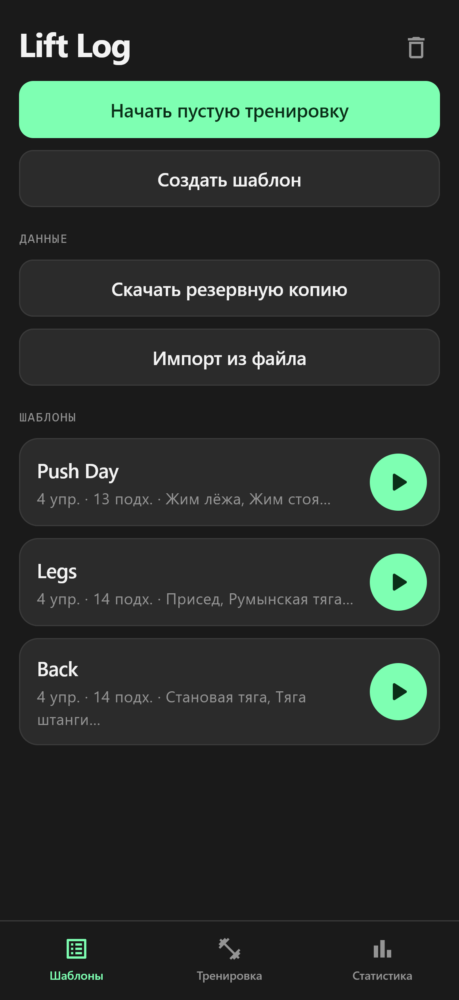
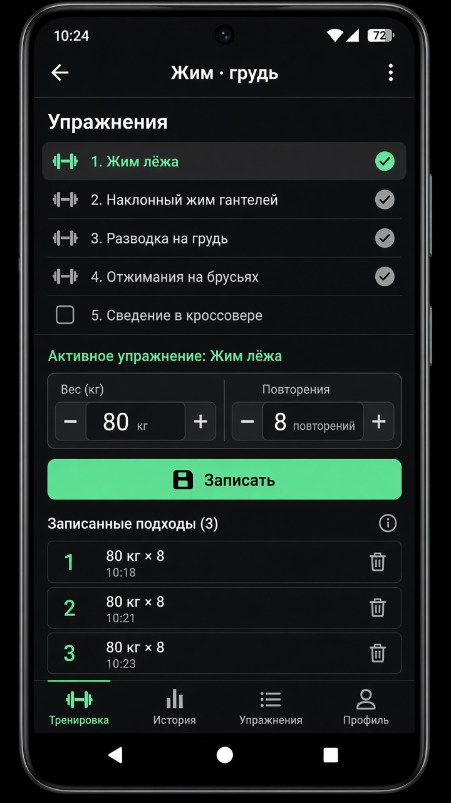
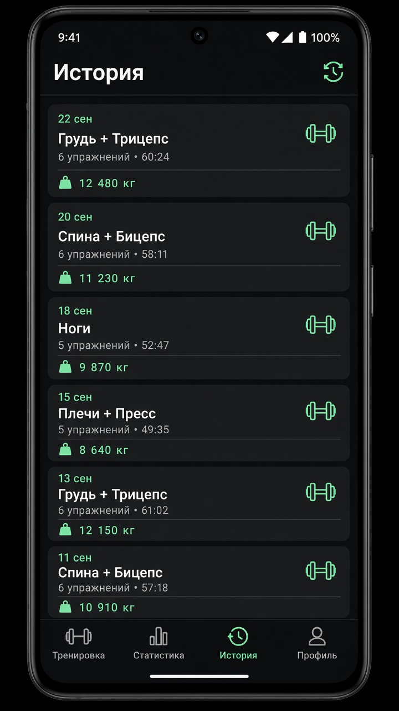
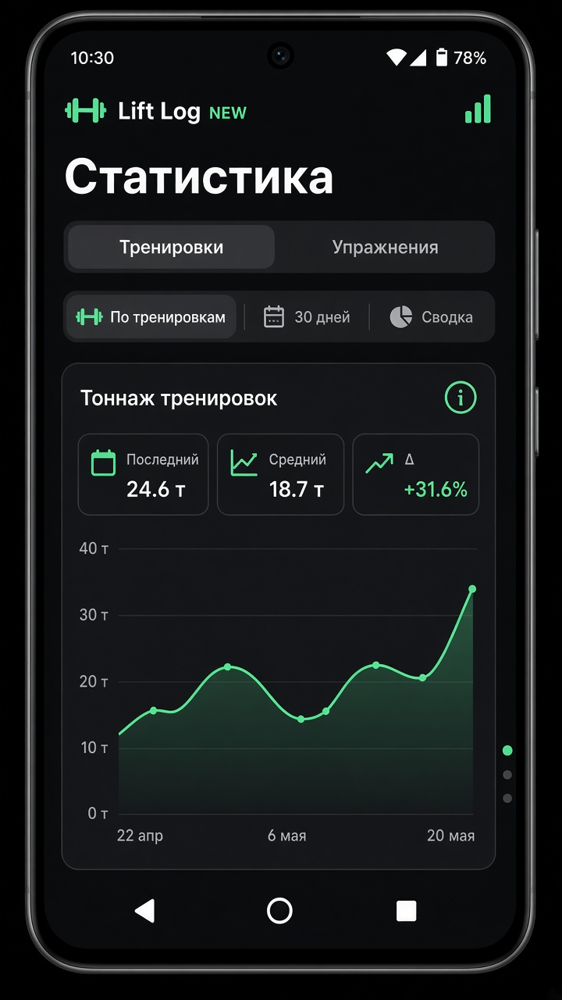
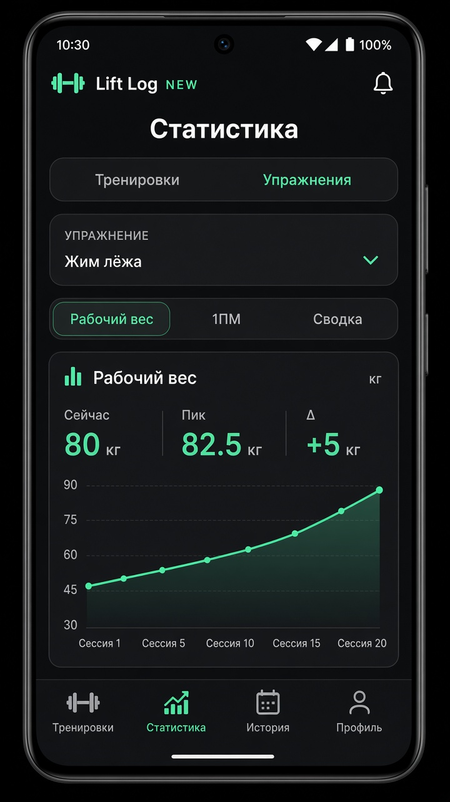

# Lift Log · GymJournal

Локальный журнал силовых тренировок на Flutter. Данные хранятся на устройстве (Drift / SQLite) — без аккаунтов и облака.

**Lift Log** is a local-first gym journal: templates, live workout logging (incl. drop / myo / cheat legs), history, backup, and dual stats (session tonnage + exercise working weight).

---

## Возможности / Features

- **Шаблоны** — набор упражнений и целевых подходов
- **Активная тренировка** — вес, повторы, типы подходов (обычный, дроп, миорепы, читинг)
- **История** — завершённые сессии и тоннаж
- **Статистика**
  - *Тренировки* — выбор программы/названия, тоннаж по сессиям и за 30 дней
  - *Упражнения* — выбор упражнения, **рабочий вес** (мода по обычным подходам) и оценка 1ПМ (Epley)
  - Интерактивные графики (тап по точкам)
- **Бэкап** — экспорт / импорт JSON

## Скриншоты / Screenshots

| Шаблоны | Тренировка | История |
|--------|------------|---------|
|  |  |  |

| Статистика · тренировки | Статистика · рабочий вес |
|--------------------------|---------------------------|
|  |  |

## Скачать APK / Download

Релизы с APK: **[GitHub Releases](https://github.com/rev3nt/GymJournal/releases)**

Прямая ссылка на последний релиз (после публикации):  
`https://github.com/rev3nt/GymJournal/releases/latest`

## Сборка / Build

Требования: [Flutter](https://docs.flutter.dev/get-started/install) (SDK ^3.12), Android SDK для APK.

```bash
flutter pub get
flutter run
```

Release APK:

```bash
flutter build apk --release
# артефакт: build/app/outputs/flutter-apk/app-release.apk
```

Windows desktop (опционально):

```bash
flutter run -d windows
```

## Структура / Structure

```
lib/
  data/       # Drift SQLite, seed, backup
  domain/     # модели, calc (тоннаж, 1ПМ, рабочий вес)
  providers/  # Riverpod
  ui/         # экраны: templates, workout, history/stats shell
  theme/      # AppColors, mono labels
```

## Рабочий вес / Working weight

Для упражнения в завершённой сессии берётся вес, который чаще всего встречается среди ног `SetType.normal`. При равенстве частоты — больший вес; если снова ничья — более поздний по времени лог.

## Лицензия

Личный / open project — см. репозиторий.
